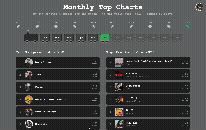

# Spotiland

Turn your **Spotify Extended Streaming History** into a visual dashboard —
no login required. Import the `.zip` Spotify gives you and explore your top
singers and tracks per month, your top genres, and when you listen.



## 1. Purpose

Spotiland turns your personal Spotify listening history into a simple, visual
dashboard. Instead of logging in through Spotify, you request your **Extended
Streaming History** export from Spotify and import the `.zip` — everything is
parsed and aggregated in your browser. The only server calls are for public
album/artist artwork, fetched with an app-level token, so **anyone can use a
deployed instance without signing in**.

## 2. Features

- **Self-service import** — drop your Spotify export `.zip` on the landing page;
  it's unzipped and parsed in-browser (jszip) and stored in IndexedDB. No data
  leaves your machine except public artwork lookups.
- **Monthly Tops** — your top singers and tracks for any month, or a whole year,
  ranked by play count, with album art and artist photos.
- **Top Genres** — genres weighted by the plays of the artists carrying them.
- **Listening Clock** — when across the day you actually listen.
- **Artwork enrichment** — album covers and artist photos are resolved through
  the backend using Spotify's public catalogue (app-level Client Credentials),
  so they work without any user login.

### Notes on Spotify API limits

- Spotify has largely **emptied the artist `genres` field** across its API, so
  **Top Genres can be sparse** — this is a Spotify-side change, not a bug here.
- Spotify deprecated **audio-features, audio-analysis, and recommendations** on
  2024-11-27 (now `403` for new apps). Features that relied on them (track-detail
  audio popup, recommendations, lyric generator) are disabled and unused.

## 3. Architecture

A React (CRA) frontend that does all the aggregation in the browser, plus a thin
Express backend whose only real jobs are **serving the built app** and
**proxying public artwork lookups** with an app-level token.

```
Spotiland/
├─ server/                 Express backend
│  └─ index.js             serves client/build + /api/enrich/* (Client Credentials)
│                          (legacy /login, /callback, /refresh_token remain but unused)
├─ client/                 React app (Create React App)
│  └─ src/
│     ├─ components/        LoginScreen (import landing), Dashboard,
│     │                     MonthlyTops, TopGenres, ListeningClock, popups, ...
│     ├─ data/              import + aggregation layer
│     │   ├─ importZip.js       unzip an export, extract streaming records
│     │   ├─ aggregate.js       records → monthly/yearly top lists + totals
│     │   ├─ historyStore.js    IndexedDB persistence (newest file wins)
│     │   ├─ HistoryContext.js  provides imported (or bundled demo) history
│     │   └─ streamingHistory.json  bundled demo dataset
│     └─ spotify/           artwork enrichment helpers (call the backend)
├─ render.yaml             Render blueprint (build/start + env vars)
├─ .nvmrc                  Node version (22)
└─ Procfile                web: npm run start-server
```

**Tech stack**

- Backend: Node 18+ (22 recommended), Express, cors, cookie-parser, dotenv
- Frontend: React 18, react-scripts 5, styled-components, jszip, chart.js, axios

**Data flow**

```
1. User requests "Extended Streaming History" from Spotify → gets a .zip by email
2. Import on "/" → jszip parses it → records saved to IndexedDB (in the browser)
3. HistoryContext aggregates records → monthly/yearly tops, totals
4. Dashboard renders the charts; for each singer/track it asks the backend for art:
      Frontend ──▶  GET /api/enrich/tracks?ids=...        (album covers)
      Frontend ──▶  GET /api/enrich/artist?name=...       (artist photo / id)
      Frontend ──▶  GET /api/enrich/artist-detail?id=...  (followers/popularity)
   Backend fetches an app-level Client Credentials token and proxies Spotify,
   returning its JSON verbatim. No user login is involved.
```

With nothing imported, the dashboard falls back to a bundled demo dataset.

## 4. Local development

### Prerequisites

- **Node 22** (`nvm use` reads `.nvmrc`)
- **Yarn**
- A **Spotify app** — only for the Client ID/Secret used to fetch public artwork
  (no redirect URI or user login needed).

### Spotify app setup

1. Go to the [Spotify Developer Dashboard](https://developer.spotify.com/dashboard) → **Create app**.
2. Enable **Web API**.
3. Copy the **Client ID** and **Client Secret**. (No redirect URI required —
   Spotiland uses the Client Credentials flow only, for public catalogue data.)

### Environment

Create a `.env` file in the repo root:

```env
CLIENT_ID=your_spotify_client_id
CLIENT_SECRET=your_spotify_client_secret
PORT=8000
```

`CLIENT_ID` / `CLIENT_SECRET` are used only to mint an app-level token for
artwork. Without them the dashboard still works — album/artist images just won't
load.

### Install & run

```bash
nvm use                 # Node 22
npm install             # installs backend deps and (via the install script) client deps

yarn dev                # starts backend (:8000) + frontend (:3000) together
# or run them separately:
#   yarn server         # backend  → http://127.0.0.1:8000
#   yarn client         # frontend → http://127.0.0.1:3000
```

Open **http://127.0.0.1:3000**, import your export `.zip`, and you're on the dashboard.

> Editing anything under `server/` requires restarting the backend (no hot
> reload); the CRA frontend hot-reloads on its own.

### Scripts

| Command         | Description                         |
| --------------- | ----------------------------------- |
| `yarn dev`      | Run backend + frontend concurrently |
| `yarn server`   | Run the Express backend (port 8000) |
| `yarn client`   | Run the CRA dev server (port 3000)  |
| `npm run build` | Build the client for production     |

## 5. Deployment

Spotiland is a single Node web service (Express serves the built client and the
`/api/enrich/*` endpoints), so it deploys to any Node host. A
[Render](https://render.com) blueprint is included:

1. Push to GitHub and, on Render, **New → Blueprint** → pick this repo
   (it reads [`render.yaml`](render.yaml)).
2. Set the two secrets in the dashboard: **`CLIENT_ID`** and **`CLIENT_SECRET`**.
3. Deploy. The blueprint runs `npm install && npm run build` and starts
   `npm run start-server`.

That's it — no redirect URIs, no per-user auth, no allowlist. Visitors land on
the import page and can explore their own history immediately.
